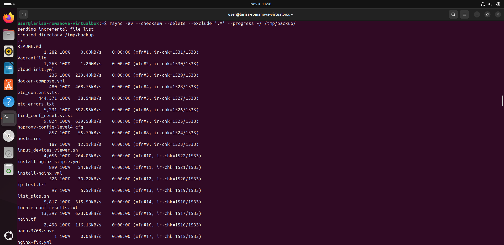
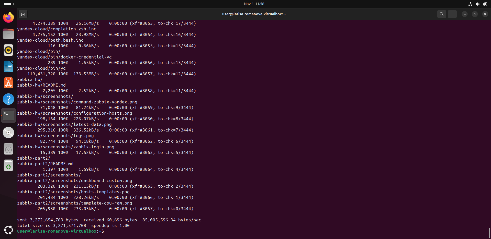
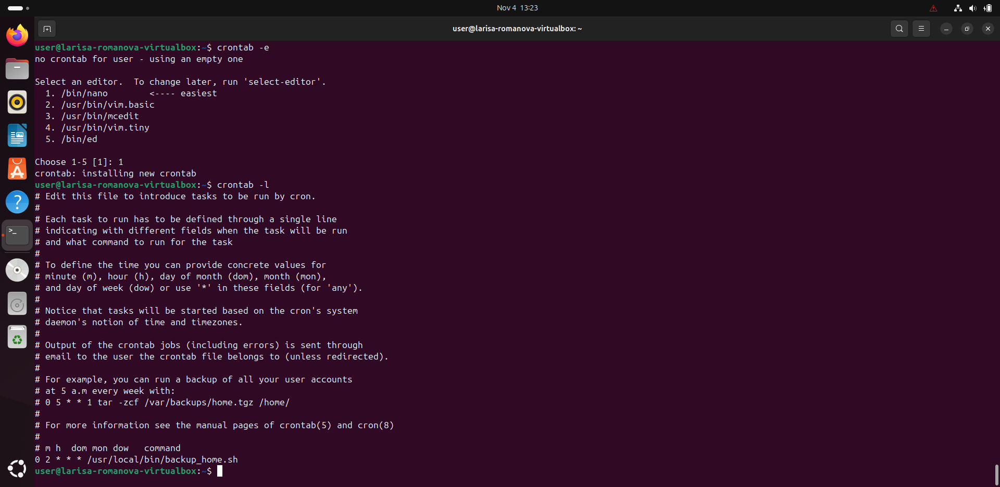
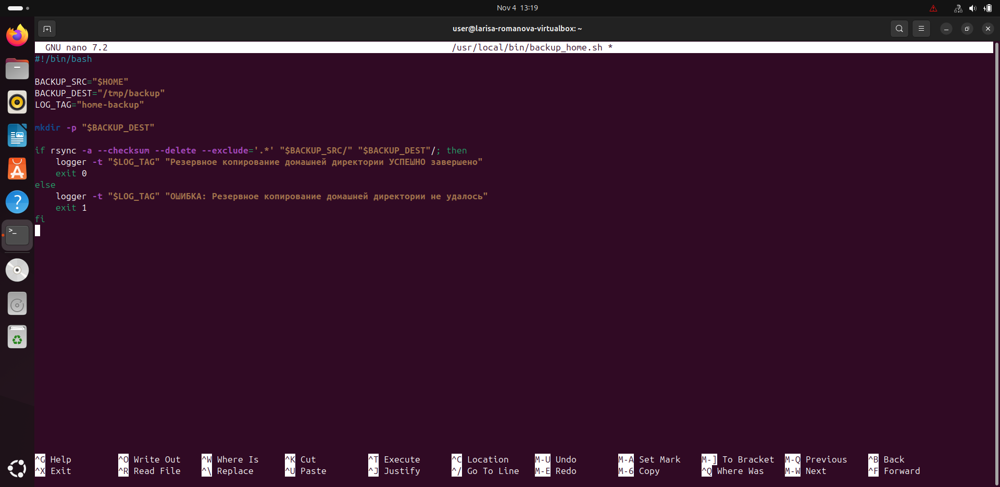
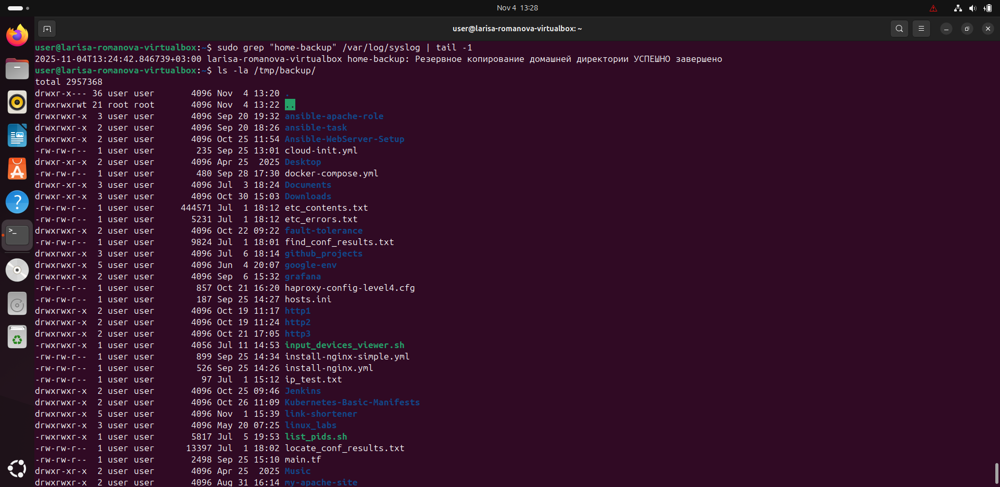
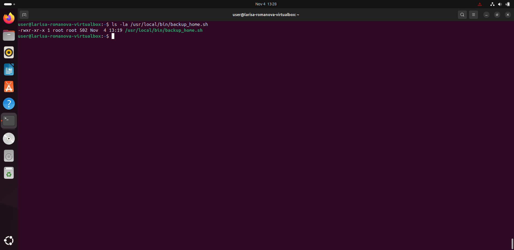

# Резервное копирование с rsync 

**Выполнила:** Лариса Романова

## Задание 1: Команда rsync для зеркального копирования

### Требования:
- Создать зеркальную копию домашней директории пользователя в `/tmp/backup`
- Исключить все скрытые директории (начинающиеся с точки)
- Использовать проверку хэш-сумм даже при совпадении времени и размера файлов

### Решение:
```bash
rsync -av --checksum --delete --exclude='.*' ~/ /tmp/backup/
```



# Задание 2: Автоматическое резервное копирование с помощью cron

**Выполнила:** Лариса Романова

## Требования:
- Написать скрипт для регулярного резервного копирования домашней директории
- Настроить задачу cron на ежедневное выполнение
- Резервная копия должна быть полностью зеркальной
- В системном логе должна появляться запись об успешном или неуспешном выполнении
- Резервная копия размещается в директории `/tmp/backup`

## Решение:

### 1. Скрипт резервного копирования

Файл: `backup_script.sh`

```bash
#!/bin/bash

BACKUP_SRC="$HOME"
BACKUP_DEST="/tmp/backup"
LOG_TAG="home-backup"

mkdir -p "$BACKUP_DEST"

if rsync -a --checksum --delete --exclude='.*' "$BACKUP_SRC/" "$BACKUP_DEST"/; then
    logger -t "$LOG_TAG" "Резервное копирование домашней директории УСПЕШНО завершено"
    exit 0
else
    logger -t "$LOG_TAG" "ОШИБКА: Резервное копирование домашней директории не удалось"
    exit 1
fi
```




